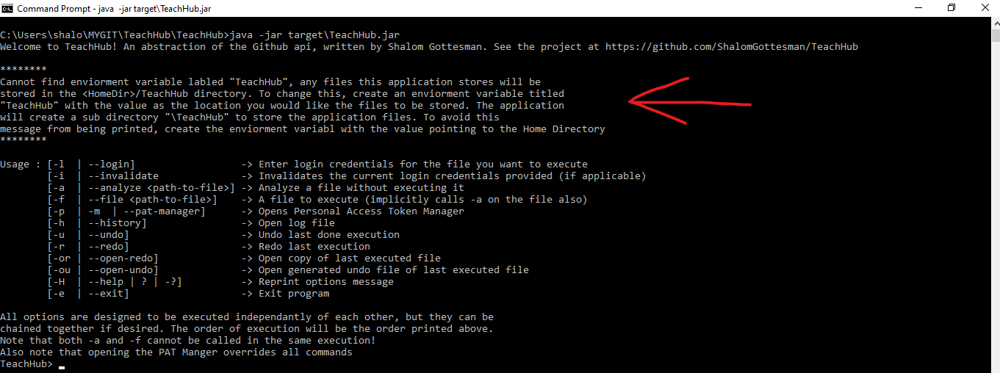

# TeachHub

An ease-of-use application based on an abstraction of the GitHub REST API designed to assist professors in generating, cloning and managing many git repositories for students. Additional usage allows user to add/remove many collaborators to repositories (specifically TAs and other Professors).

## Capabilities

TeachHub has the following uses:

1. Create repositories at wiil (either personally owned or under an organization)
2. Add/Remove collaborators to respositories (that either existed beforehand or that were created by TeachHub)
3. For organization repositories: can add collaborators with read-only access
4. Delete repositories
5. Clone repositories to a given location on user's computer

## Use Cases

1. Professor wants to generate GitHub repositories for each student in his class and does not want to go though the repetitive process of creating them from the GitHub UI. (See tags: Create_Repo, Make_Private)
2. Professor wants to add the same people to many different repositories (such as one or more Teach Assistants, or other professors). From the GitHub UI this is a highly repetitive process. (See tags: all Add_Collab tags, all Remove_Collab tags, Read_Only)
3. Professor wants to add many students to one repository that contains starter code for an assignment.
4. A TA or proffesor who was just invited to many repositories can accept invitations to specified repositories, something that can also be highly repetitive (See the Accept_Invite tag)
5. Clone many repositories to your computer (See 

This guide is broken down into three section: Setup, File Syntax, Execution. Also see the end for FAQ and the TeachHub API

## Setup
1. For this application to run correctly, you should have Java 8 or later installed on you computer. 
2. This application stores .CSV files on your computer for undo/redo purposes. By default, this application will create a folder called "TeachHub" in your home directory and will output a message on startup declaring this. 

To change this, create an enviorment variable called "TeachHub" (without quotes) with the value being the location you would like the application to create the sub directory "/TeachHub" to store the files.

3. GitHub is no longer allowing the use of ones regular password to be used at the API interface, rather the user must create a Personal Access Token (PAT). TeachHub has built in a PAT manager that securly stores the token on the file system to be reused between different sessions. Please see https://help.github.com/en/github/authenticating-to-github/creating-a-personal-access-token-for-the-command-line for more info on creating such tokens. Below is a picture of the PAT Manger. There is also a demo video in the main folder of this repository demonstrating the use of the PAT Manger. Accessing the PAT Manger can be done with a -p command of the main TeachHub UI. If the user plans to use TeachHub only once on any particular computer, it is not worthwhile storing a PAT locally, rather the user will be able to copy the PAT to the command line as if it were his password. However if the user plans to use TeachHub on this computer in more than one instance: the creation of a PAT is a somewhat annoying process, the ability to store them locally can be advantagous. For more details how this works, see the end of this README. This can come in handy if the user operates two GitHub accounts on the local computer. When executing a file the user can choose which accounts PAT to use for that file. Each PAT will have the user's profile name attached so it will be easy to tell which PAT to use.

The process to set up PATs in the manager is as follows:
  1. First follow the link above to create the token copy the token to notepad, or somewhere else to store the token temporarily
  2. Start up TeachHub (shown below) and start up the manager with a -p command.
  3. Once in the PAT manager, type -a to add a new token
  4. You will then be asked for the username that will be used with token when authenticating with GitHub
  5. You will then be asked for the token, but it will not appear on screen when you copy it from your clipboard. The manager will make sure that you sucessfully pasted your token, and will ask to try again if nothing showed up. For that reason only try once to paste, worst case you didnt actually do so and will try again.
  6. You will then be asked to select a security level with which to encrypt the token.
  
 An view of the PAT Manger, and an example of storing a PAT on file is shown below

## File Syntax
Currently, TeachHub can only operate on .CSV files (possible update for excel files coming). That being said, the CSV files must be formatted properly for the application to work correctly. These are the proper headers that the first line of the CSV must have. It does not have to have all the heads, just the ones applicable. Paired with each header is the "argument" it is meant to take in the cells beneath it, the argument type is in [] brackets. For all Yes/No parameters, yes activates the tag for that row, while anything else leaves the feature turned off. Any String parameter is assumed to be what you want to pass in. Meaning you can selectivly turn off or on Yes/No features per command, but you cannot do so for String parameters. After the [] brackets there is a brief description of what the tag does. Unless otherwise specified, all fields are optional to be used.

 * Owner \[String\] -> The owner of the respository. This is a required field!
 * Repo_Name \[String\] -> The respitory name. This is a required field!
 * Create_Repo \[Yes/No\] -> Specifies if this repository should be created.
 * Make_Private \[Yes/No\] -> If when creating a repository it should be private, does not work if the repository already exists
 * Prof_Add_Collab \[String\] -> Add a collaborator (see reason for Prof, TA, and Student below)
 * Prof_Remove_Collab \[String\] -> Remove collabrator
 * TA_Add_Collab \[String\] -> Add a collaborator
 * TA_Remove_Collab \[String\] -> Remove collabrator
 * Student_Add_Collab \[String\] -> Add a collaborator
 * Student_Remove_Collab \[String\] -> Remove collabrator
 * Accept_Invite \[Yes/No\] -> Accept inviation to repository
 * Read_Only \[Yes/No\] -> Make all inviations on this line to read-only invitations
 * Git_Clone_To_Computer? \[Yes/No\] -> Clone respository to computer?
 * Git_Clone_Location \[String\] -> Location to clone to
 * Delete_Repo \[Yes/No\] -> Delete repository, will require confirmation.
 
 Each line under the header line will be parsed into its own command to be executed. Note that each command must be "reletively complete" to each other command in the file. This means that if one line uses a tag, so must all the rest. There cannot be empty slots in the CSV file. That does not mean that the command must make sense though, if you want to invite two people to one repository, but only one to a different one, you can invite the same person twice to the second repository to make the command complete.
 
  You might be wondering why there are three different add collaborator tags (Prof, TA, and Student) and the same for removing a collaborator. When TeachHub executes a file, it stores an "undo" file that will reverse most of the actions attempted by the first file. This can be helpful if the professor either creates many repositories for a temporary use and wants to delete them after - TeachHub made the file for the professor. Alternatively if the professor added people to many respositories for a temporary amount of time, again TeachHub generates the undo file. The different tags do not actaully change the type of collaborator being added, but when the user wants to use an undo file, he can edit it before use. Having different headers can make it clearer which should or should not be removed from the file he now wants to execute.

 When it comes to defining a repository's "absolute" location, the URL of a repository shows the relevant information. For example, this repository's url is ShalomGottesman/TeachHub, ShalomGottesman is the owner of the repository, and TeachHub is the repository's name. It can then be said that ShalomGottesman ownes the TeachHub repository (which is a true statement if I may say so myself :))It could be however that I have rights in creating the repository, but the repository is under a GitHub organization (eg. MyOrg/TeachHub). In this case the organization's name is the owner field in defining the absolute location of the repository, not the person who owns the organization. Therefor, if you are creating or interactng with a repository that is owned by you personally, then the username you intend to use to log in should be the same information you use in the Owner tag. If you intend to create or interact with the repository elsewhere (like in an organization, or someone else's repository that you were given access to) the organization's or other owner's name should be in the Owner tag and the credentials you use to log into to GitHub should have access to that organization or respository.
 
 Please note that the Read_Only invite tag is only available for Organization repositories, it will not work for personal ones. Also note that the Read_Only tag will make all the invites on that line read only!
 
 A couple points to keep in mind in terms of combining different tags:
 
 1. It is recommended that only one of Create_Repo and Delete_Repo is used per file to be executed, as it has not been tested if the logic will compute fully when trying to deal with both.
 
 2. Anything is possible, but it wouldn't make much sense to try to create a repository and also accept an invitation to that same repository. If you are using both of these tags in the same file it is likely that one of them should have a "no" in 
 
 3. Trying to clone a repository and delete might lead to issues, you can imagine why.
 
 Sample CSVs and their "cases" are shown below:
 
 ### Case 1
 
 
 The user (in this case me: ShalomGottesman) wants to generate 4 private repositories named Example1 through Example4, except he does not want Example3 to be private (hence the Make_Private column is labled no in the Exmple3 row). Additionally he wants to add Foo as a collaborator to all 4 of them. Lastly, he wants to clone the repository to his local computer at C:\Users. 
 
 
 ### Case 2
 
 
 The user wants to generate 4 private repositories under his ogranization, called MyOrg, for 4 students to each have one repository. Each repository will have only student added to that repository, but there will be a professor, prof1, added to all the repositories as well. (This is an example where seperate types of adding collaborators can be helpful, they do the same thing, but the tags make clear what information is what)
 
 
 ### Case 3
 
 
 The user has one repository that already exists in his organization. He wants to add 4 students to that repository with read only access. Note that the same result can be accomplished with the following layout as well.
 
 
 
 ### Case 4
 
 
 User wants to accept many the invitations to many different repositories he was invited to.
 
## Execution

Once you have called the application to begin, the options will appear, they are all self explanatory in their purpose. 

When executing a file, the application will first analyze the file passed in and present: a summery of what is about to be executed, and samples of the undo/redo files that will be generated and saved in the "/TeachHub" folder as discussed in the first section.
 Also when executing a file, there will be some user dialog to complete with the command line:
 1. User credentials for the application to use with the Github API
 2. Verification to delete a repo (if applicable)
 3. User credentials for cloning the repo to the local computer (if applicable)
 
 Note that for all undo/redo purposes, the Cloning information from the execution file is left out, this is to prevent trying to clone again to the same location or accidentally deleting files from the local computer.
 
 
 
 As shown, to run a file use the -f flag followed by the absolute path to the file. You will then be asked if you want to use a password/PAT that you have to put into the system or if you want to use a PAT that is stored on disk (see the setup section). After you select either method of authentication TeachHub will run the file you provided. At the end it will display a summery of what was done along with any errors along the way that were encountered.
 
 For a full demonstration, there is a demo video in the root directory of this project.

 
## FAQ

### Q: What is the "root directory" for this FAQ?

A:  When you clone the TeachHub repository, the result is a `TeachHub` root directory.  The source code resides in `TeachHub/TeachHub`.

### Q: How do I build TeachHub?

A: 

> cd TeachHub
> 
> mvn package

After the build process completes, you should see `TeachHub.jar` in `TeachHub/target` directory.

### Q: How do I start TeachHub?
 
A: With java installed, type the following into the command line: 

`java -jar target/TeachHub.jar`

 
### Q: What happens when I add someone to a repository via TeachHub?
 
A: The username you provided will be added to the lsit of collaborators for that repository, at which an invitation will be sent to the email address associated with the username to accept the invitation. Note that the user who is accepting the invitation must be logged into GitHub on the browser where he is clicking the link from! Otherwise they will receive an 404 error.
 

 
### Q: How to export to a csv from excel?
 
A: This is very important, when dealing with excel to format your table and then exporting out to a csv file you must make sure you export in the correct format. Excel has many options for how to export to a CSV, there is UTF-8, for Mac, ect. just select Comma Deliminated and it should work. If it does not work try exporting the file again and rerun the application. 
 
 
 
## PAT Manager in Depth
 When the user gets a PAT from the GitHub UI and passes it to TeachHub for storage, the PAT is always encryped so that it is not stored in plain text. The user is able to specify how much security he wants behind that encryption. Selecting NONE when prompted will use a default encyption, it will not be stored in plain text, but the symmetric encryption key is hard coded into the program. Chosing a level of LOW or HIGH (where the difference is the minimum requirment of password strength) will then encypt the PAT over a password provided by the user. In no way are the origional PAT, not the password/encyption key stored locally on the system. An attempt at decryption will check the hashvalue of the provided password if it matches the hashcode of the origional key used, if they match the key is decrypted and then sent with the username to GitHub for verification. Only if GitHub verifies the PAT will the user be able to continue. 
 
## API

 Both the PAT manager and the main class of TeachHub can be interfaced for scripting use, or to avoid typing. Please see the runner.Main class, specifically the mainW_File and mainW_FileW_Creds methods. Also see the pat_manger.PAT_Manger.retreiveToken() methods.
